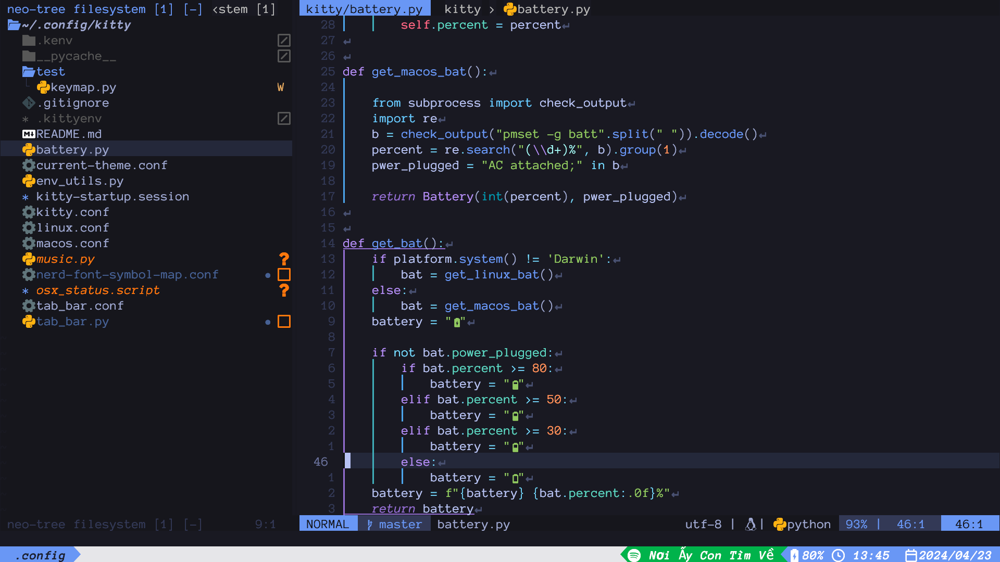

# Setup
```
cd ~/.config
git init
git remote add origin git@github.com:sytranvn/config.git
git pull origin master
```
# TODO
Configurations that I need, but haven't set up
- [ ] DAP config for common language like JS, Python. Should be as easy to use as VS Code
- [ ] Gcloud config, currently need to use default terminal to ssh gcloud
